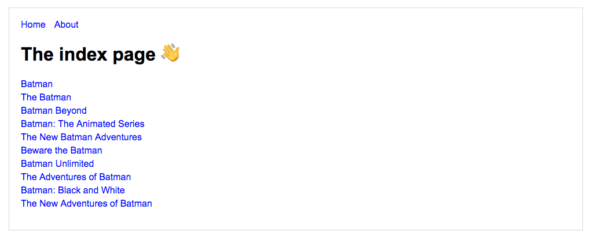

# App learn en Next.js

Ejemplo de prueba de next.js donde me conecto a la api de [TVmaze API](http://www.tvmaze.com/api).

[Ejemplo funcionando](https://react-test.pquinteros.now.sh)

  

## Instalación

Puedes usar estos comandos para correr la aplicación.

`npm install` para instalar las dependencias.

`npm run dev` para el entorno de desarrollo.

`npm run build && run start` para el entorno de producción.

## License
[MIT](https://choosealicense.com/licenses/mit/)